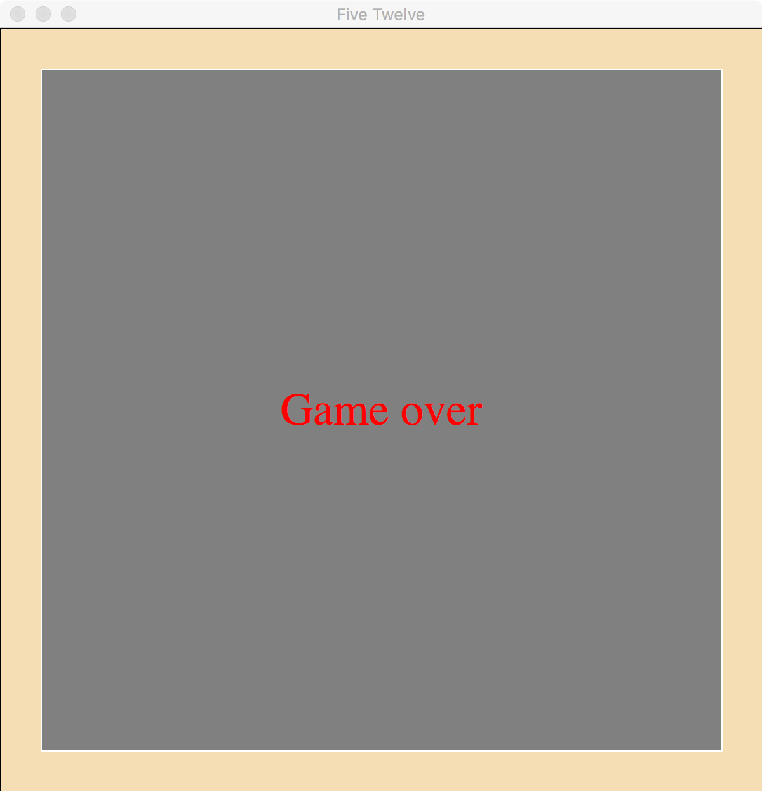
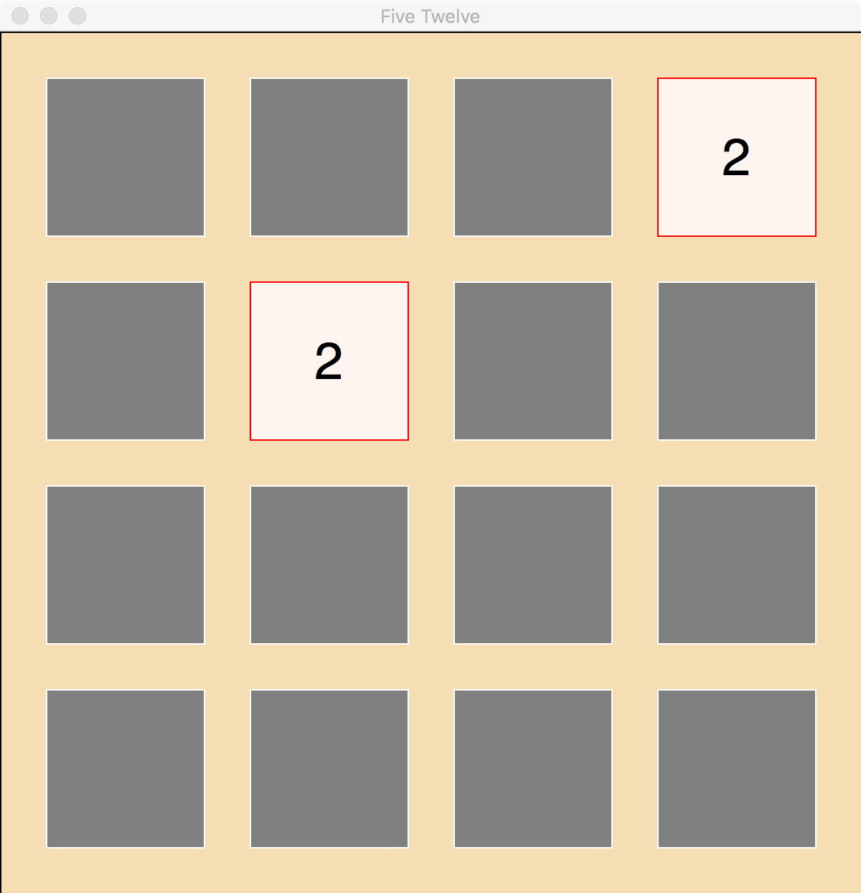
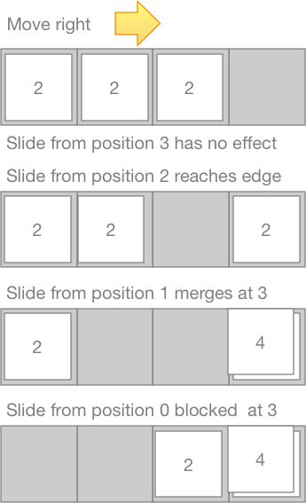
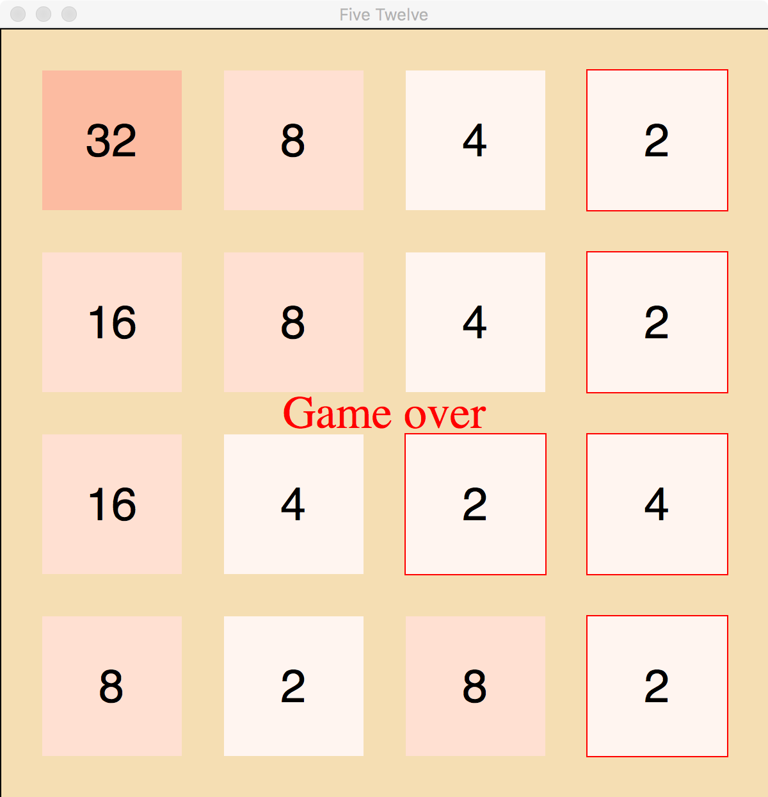
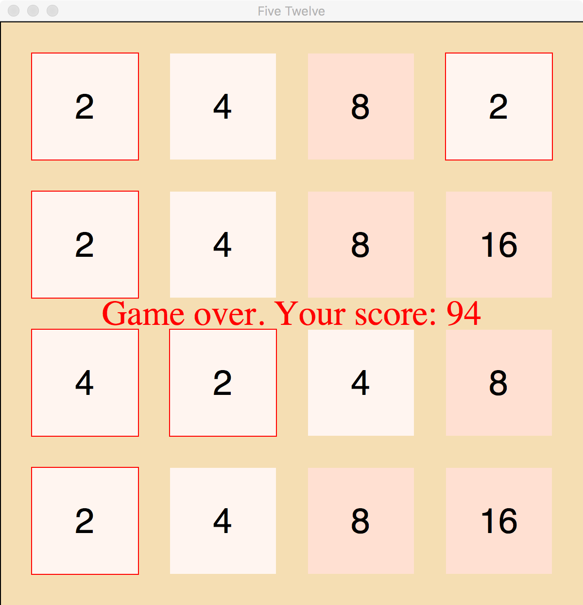

# Developing the FiveTwelve Game

As you encounter larger projects, in courses and for other purposes,
it is important to develop tactics for breaking large problems down into
smaller parts and developing them incrementally.  Design a little,
code a little, test a little, repeat.  In what follows, I will try
to walk you through a realistic development
order for the FiveTwelve game.  I will provide you with much of the
necessary code, but not all of it, and you will have to understand it
to assemble the pieces and add your parts.

While I am trying to make it realistic, there are a few deviations
from the development sequence you might actually follow if you
were building the project from scratch.  The largest is that I have
provided a complete working version of the graphics, leaving you
the game logic to complete.  This helps you concentrate on one
module, but it's a little unrealistic.   When I actually built
my sample solution the first time, I moved between the game logic
and the graphic interaction, developing a little bit of each at a time.

The second main deviation from realistic development order is that
I am not showing you the back-tracking I did in the original development.
We do not get everything right the first time.  Nobody does.  Ever.
We make not only small programming mistakes, but major mistakes of organization,
or at least we see opportunities for better organization as we progress.
Even in reworking this for you for Winter 2019, I got nearly through
it (while creating these notes) and then found a way to significantly
clean up and shorten the code.  I considered realistically representing
that iteration, walking you through developing it as I first did and
then going back to revise several parts of the code ... in fact I wrote
those instructions, but then decided it would be clearer and less
frustrating to pretend I had seen the optimization earlier.

## Skeleton

A skeleton is of model.py is provided for you.  This skeleton
is a set of "stubs" for the things needed by the game
manager and view.

### Model-View-Controller

We want to keep the game logic as separate as possible
from the graphical display and interaction.  For example,
the current graphical display is based on the Tk graphics
package that comes with Python.  Tk is pretty clunky,
but has the advantage of being pre-installed with
Python.  If we wanted nicer graphics, we could use the
PyQt graphics package.  The code for FiveTwelve is
organized in a way that would allow us to replace the
'view' (graphics interaction) component without changing the 'model'
(game logic) component at all.

How do we do this?  We use a pattern called Model-View-Controller,
in which "listeners" can be dynamically attached to the "model".
The "model" must notify all the listeners of events, but
then it is up to the listeners (which belong to
the "view" component) to update the display.  The basic
skeleton for this is provided in "game_element.py".
"game_element" defines what an *event* is (class
```GameEvent```), what a *listener* is (class ```GameListener```),
and what a *game element* is (class ```GameElement```).
The game listeners are defined by the "view" component;
we don't have to look farther at them (and that's the
whole point of this organization).  The game elements
are what we will define in the "model" component.
We will have two kinds of game elements, the
```Board``` and the individual ```Tile```s on the board.


### The Board Class

The board holds the tile.  It will be associated
with a display (view) element, so it should
be a subclass of ```GameElement```:

```python
from game_element import GameElement, GameEvent, EventKind
...
class Board(GameElement):
    """The game grid.  Inherits 'add_listener' and 'notify_all'
    methods from game_element.GameElement so that the game
    can be displayed graphically.
    """
```

We imported GameEvent as well as GameElement because
we will "notify" listener objects when an interesting
game event occurs.  The listener objects (defined
in `view.py`) will be responsible
for updating the display.

The ```__init__``` method of ```GameElement``` performs
some initialization.  We don't want to repeat it here,
but it needs to be done.  There is a special ```super``` function in
Python for referring to a method in the "superclass" of a class.
```GameElement``` is the superclass of Board, so the
```__init__``` method of ```Board``` calls the
```__init__``` method of ```GameElement``` this way:

```python
    def __init__(self):
        super().__init__()
```

The game manager and view component expect the
Board object to contain a list of lists of tiles.
Soon we will need to initialize that properly, but for
now we'll just leave a stub definition, so our first
cut at the constructor (the ```__init__``` method) is

```python
    def __init__(self):
        super().__init__()
        self.tiles = [ None ]  # FIXME: a grid holds a matrix of tiles
```

If you are using PyCharm, you may notice that PyCharm uses a
special color for the FIXME comment.  TODO comments
are also highlighted.

We need a few more pieces to get started.  The game manager
needs a way to determine whether there is at least one
empty space on the board.  If there is, it needs a
method for placing a tile on a randomly chosen
empty space.  If there is not, it will stop the game and
needs a way to calculate the score.  For now
we will create *stub* methods that don't do anything
useful.  We mark thise with ```# FIXME``` since they
are code we will need to complete soon.

```python
    def has_empty(self) -> bool:
        """Is there at least one grid element without a tile?"""
        return False
        # FIXME: Should return True if there is some element with value None

    def place_tile(self):
        """Place a tile on a randomly chosen empty square."""
        return
        #FIXME

    def score(self) -> int:
        """Calculate a score from the board.
        (Differs from classic 1024, which calculates score
        based on sequence of moves rather than state of
        board.
        """
        return 0
        #FIXME
```

### The Tile Class

We need numbered tiles to slide around on the board.
We can't do much more with the ```Board``` class until
we have ```Tile``` objects to place on it.  These are
also ```GameElement```s, because each tile will be
displayed on the board. Like the ```Board```, each
```Tile``` will need to call the ```__init__``` method
of ```GameElement``` in its own ```__init__``` method:

```python
class Tile(GameElement):
    """A slidy numbered thing."""

    def __init__(self):
        super().__init__()

```

### The world's stupidest game

With just this skeleton code in ```model.py```,
the game manager can run, but the game is not
much fun.

```bash
\$ python3 game_manager.py
```



### Rows and Columns: The Vec class

Tiles on the board are arranged in rows and columns.
We can think of (row, column) as the (x,y) of a coordinate
system, although in this case the x component (row) is vertical
with 0 at the top and positive numbers going down, and
the y component (column) is the horizontal direction.
Although the orientation of the coordinate system is different
from the conventional Cartesian system with (0,0) at the lower
left, it can be treated exactly the same.  In particular, we
can interpret a position (x, y) as a vector from the origin,
or from another position. Considered in this way, it is
natural to think of adding vectors: (x1, y1) + (x2, y2) =
(x1 + x2, y1 + y2).  We will create a class ```Vec``` that
provides this ```+``` operation as a "magic method"
```__add__(self, other: "Vec") -> "Vec"```.

*Aside 1:  When I initially created this program, I did not make a
```Vec``` class.   I nearly completed the program before realizing
that a ```Vec``` class could considerably simplify some later parts
of the program.  I am short-cutting the actual development sequence to
avoid walking you through simple but widespread revisions that I
made when I introduced ```Vec``` late in development.*

*Aside 2: Why the quotes around ```"Vec"``` in the method signature?
Python does not consider the class ```Vec``` to be defined until
the class is complete.  If we wrote the signature as
```def __add__(self, other: Vec) -> Vec```, the type checker would
complain that ```Vec``` is not defined.  Quoting the type in a method signature
says "trust me, there is going to be a Vec type by the time we use this."*

### Testing the Vec Class

We will create test cases after each small step of development.
Sometimes we will write some code and then write test cases for that
code, and sometimes we will write the test cases first and then code
to satisfy the test cases.

The file ```test_model.py``` is where our test cases live.  It uses the
Python ```unittest``` framework.

```python
from model import Vec, Board, Tile
import unittest
```

We create a couple of simple test cases to make sure we didn't mess
up the constructor, the ``__eq__`` method, or the ```__add__```
method.

```python
class TestVec(unittest.TestCase):

    def test_equality(self):
        v1 = Vec(7, 12)
        v2 = Vec(8, 13)
        self.assertNotEqual(v1, v2)
        v3 = Vec(7, 12)
        self.assertEqual(v1, v3)

    def test_addition(self):
        v1 = Vec(8, 7)
        v2 = Vec(12, 15)
        self.assertEqual(v1 + v2, Vec(20, 22))
        # Addition does not modify the points that have been added
        self.assertEqual(v1, Vec(8, 7))
        self.assertEqual(v2, Vec(12, 15))
```

If we haven't written the methods yet, we'll get error messages
when we run ```test_model.py```:

```text
EE
...
======================================================================
ERROR: test_equality (__main__.TestVec)
----------------------------------------------------------------------
Traceback (most recent call last):
  File "/Users/michal/Dropbox/19W-211/projects/dev/fivetwelve/test_model.py", line 15, in test_equality
    v1 = Vec(7, 12)
TypeError: object() takes no parameters

----------------------------------------------------------------------
Ran 2 tests in 0.005s

FAILED (errors=2)
```

So we write the methods:  A constructor (```__init__```),
an equality check (```__eq__```) as a magic method for ```==```,
and ```__add__``` as a magic method for ```+```.  When we have
written them, we can run the tests again and should get better
results:

```text
..
----------------------------------------------------------------------
Ran 2 tests in 0.000s

OK
```

### Tile State

The *state* of an object is all the values it contains.
A ```Tile``` object clearly needs to hold a number, but
it will need a little more than that.  In the game
we will slide the tiles around on the board, so we can
surmise that part of the state of a ```Tile``` object
is its position (row and column index) on the board. We might
guess that it's constructor (`__init__` method) should look
something like this:

```python
    def __init__(self, pos: Vec, value: int):
        super().__init__()
        self.row = pos.x
        self.col = pos.y
        self.value = value
```

Will this be enough?  We know there will be some game logic about
tiles bumping into each other and either stopping or merging.  Should
this logic be in the ```Board``` class or the ```Tile``` class?  If the
logic for "bumping into" another ```Tile``` is in the ```Tile``` class, then
a ```Tile``` object might need to hold another value:  It would need
to know the ```Board``` it belongs to, so that it can check for the
presence of another ```Tile``` at a certain position in the ```Board```.
We might have to add this later.  On the other hand, perhaps this logic
belongs in the ```Board``` class anyway, in which case we might not need
it here.  We will make a tentative decision to keep the ```Tile``` object as
simple as possible while noting that we may need to augment it later
if it causes the logic in ```Board``` to be unnecessarily complicated.

### Constructing the Board

Now that we have some state in the ```Tile``` objects, we can make some
progress designing the ```Board``` class.  The state of a ```Board```
must clearly consist of rows and columns of positions that are either
empty or contain a ```Tile```.  A list of lists is a natural way to
represent the rows and columns.  Occupied positions should obviously
be represented by ```Tile``` objects.  What about unoccupied positons?
We could create a special *empty* tile (maybe giving it the value 0)
or we could use the Python value ```None```.  It isn't obvious which
approach is better, so we'll tentative choose to use the ```None``` value
for unoccupied positions.

We will need to place a couple tiles on the initial board.  Should we do
that as part of the constructor?  Or should that be separate?   How should we
decide? We will definitely need a separate function for placing a tile in a
random position before each turn.  There is no compelling reason to repeat
this functionality in the constructor, or to combine them by having the
constructor call the tile placement method.  When there is no compelling
reason to combine two logically distinct actions, it is generally preferable
to keep them separate.  If we change our minds, it is much easier to combine
two actions that were separate than to separate two actions that were combined.

If we consider how we will write test cases for the ```Board``` class, we
will see another hint that the constructor should not include initial tile
placement.   We will want to write
testing functions that load the board with tiles in known positions.  So we
have at least one example of a situation in which it will *not* be useful to
include initial tile placement in the constructor for ```Board```.  This
reinforces our initial decision that the constructor should create an *empty* board,
with initial tile placement handled separately.

We might consider writing the constructor method this way:

```python
class Board(GameElement):
    """The game grid.  Inherits 'add_listener' and 'notify_all'
    methods from game_element.GameElement so that the game
    can be displayed graphically.
    """

    def __init__(self):
        super().__init__()
        self.tiles = [ [None, None, None, None],
                       [None, None, None, None],
                       [None, None, None, None],
                       [None, None, None, None]]
```

This would work, but it hard-wires the 4x4 size of the board into the constructor.
Let's make it a little more flexible, allowing the size of the board to be
specified in the constructor.  We can make 4x4 be the default, but still allow other
sizes, using keyword arguments:

```python
    def __init__(self, rows=4, cols=4):
        super().__init__()
        self.rows = rows
        self.cols = cols
        self.tiles = [ ]
        for row in range(rows):
            row_tiles = [ ]
            for col in range(cols):
                row_tiles.append(None)
            self.tiles.append(row_tiles)
```

This is a little more complicated ... we'd better write a test case to make sure
we got it right.

We'll add a couple of simple test cases to make sure the loops in the constructor
are working as intended:

```python
class TestBoardConstructor(unittest.TestCase):

    def test_default(self):
        board = Board()
        self.assertEqual(board.tiles, [[None, None, None, None],
                                       [None, None, None, None],
                                       [None, None, None, None],
                                       [None, None, None, None]])

    def test_3x5(self):
        board = Board(rows=3, cols=5)
        self.assertEqual(board.tiles, [[None, None, None, None, None],
                                 [None, None, None, None, None],
                                 [None, None, None, None, None]])
```

Executing ```test_model.py``` in PyCharm (or in a terminal window, if you prefer), we
get confirmation that the constructor is creating the ```tiles``` values we
expect:

```bash
/usr/local/bin/python3.6 /Users/michal/Dropbox/19W-211/projects/dev/fivetwelve/test_model.py
..
----------------------------------------------------------------------
Ran 2 tests in 0.000s

OK
```

### Treating a Board as a collection

Above we have defined a ```Vec``` class that can be used to specify
a row and column.  If we have

```python
pos = Vec(1,2)
```

We could access a tile as

```python
tile = board.tiles[pos.x][pos.y]
```

but it is rather verbose.  Recall how we used *magic methods* to define
operations like ```<``` and ```==```?  We can do the same thing
for accessing collection elements.  We can define a ```[]``` operation
to allow us to shorten the above to
`tile = board[pos]`

Here are the magic methods we need:

```python
    def __getitem__(self, pos: Vec) -> Tile:
        return self.tiles[pos.x][pos.y]

    def __setitem__(self, pos: Vec, tile: Tile):
        self.tiles[pos.x][pos.y] = tile
```

### Placing Tiles

So now we can create an empty board ... how about placing some tiles on it?
We will want a way to place a new tile at a random open position, but we also
need a way to determine whether there are any open positions at all.  Both of
these actions require searching through the board to collect all the open
positions (that is, the rows and columns with value None); the former also
requires making a random selection from that collection.  So, let's build a
method that returns the list of open positions.  Something like:

```python
    def _empty_positions(self) -> List[Vec]:
        """Return a list of positions of None values,
        i.e., unoccupied spaces.
        """
```

There are a couple of things to notice about this method signature.  First,
note that the method is named ```_empty_positions```, with a leading underscore.
This is a convention in Python indicating that ```_empty_positions``` is an
*internal method* (you might also call it a *private method*) of the ```Board```
class.  It is intended for use only by other methods in the ```Board``` class,
and not by code outside the class.   Python does not enforce this restriction, but
it encourages it with the ```help``` function in the console:

```text
PyDev console: starting.
Python 3.6.5 (v3.6.5:f59c0932b4, Mar 28 2018, 05:52:31)
[GCC 4.2.1 Compatible Apple LLVM 6.0 (clang-600.0.57)] on darwin
import model
help(model.Board)
Help on class Board in module model:
class Board(game_element.GameElement)
 |  The game grid.  Inherits 'add_listener' and 'notify_all'
 |  methods from game_element.GameElement so that the game
 |  can be displayed graphically.
 |
 |  Method resolution order:
 |      Board
 |      game_element.GameElement
 |      builtins.object
 |
 |  Methods defined here:
 |
 |  __init__(self, rows=4, cols=4)
 |      Each game element can have zero or more listeners.
 |      Listeners are view components that react to notifications.
 |
 |  has_empty(self) -> bool
 |      Is there at least one grid element without a tile?
 |
 |  place_tile(self)
 |      Place a tile on a randomly chosen empty square.
 |
 |  score(self) -> int
 |      Calculate a score from the board.
 |      (Differs from classic 1024, which calculates score
 |      based on sequence of moves rather than state of
 |      board.
 |
 |  ----------------------------------------------------------------------
 |  Methods inherited from game_element.GameElement:
 |
 |  add_listener(self, listener:game_element.GameListener)
 |
 |  notify_all(self, event:game_element.GameEvent)
 |      Instead of handling graphics in the model component,
 |      we notify view components of each significant event and let
 |      the view component decide how to adjust the graphical view.
 |      When additional information must be packaged with an event,
 |      it goes in the optional 'data' parameter.
 |
 |  ----------------------------------------------------------------------

```

Notice anything missing?  Like that ```_find_empties``` method we just created?
It is omitted from the *help* text because Python recognizes the leading underscore
as an indication that the method is not relevant to *users* of the class.

You may have also noticed the specified return type of the method:

```python
List[Vec]
```

We could have written the method signature as

```python
    def _empty_positions(self) -> list:
```

but I have chosen to be more explicit about the kind of list that
the method will return:  It will return a list of Vec objects.
To do this, we need to add an ```import``` of the ```typing``` module
that defines the *type constructors* ```List```:

```python
from game_element import GameElement
from typing import List
```

We might first be inclined to write the search loop using list iterators:

```python
        empties = [ ]
        for row in self.tiles:
            for col in row:
                if col is None:
                    # OOPS, how do I get the indexes?
        return empties
```

Unfortunately, if we write the loop that way, we have access to the item but
we don't have the (row, column) indices that we need.  So, you'll have to write
the loop using the ```range``` and ```len``` functions:

```python
        for row in range(len(self.tiles)):
            for col in range(len(self.tiles[row])):
```

Modify the body of the loop accordingly to use the indexes and append the
(row, column) pair to the ```empties``` list:

```python
                    empties.append(Vec(row, col))
```

With this ```_empty_positions``` method we can easily complete the
```has_empty``` method:  It should call the ```_empty_positions``` method
and return ```True``` iff the returned list is not empty.

Although we can't write a thorough set of tests for ```has_empty``` yet, we can write
one very simple test case:  A newly created board should always have at least one
empty spot.  Let's add that to our ```TestBoardConstructor``` class in ```test_model.py```:

```python
    def test_constructed_empties(self):
        """A newly constructed Board should always have at least
        one empty space.
        """
        board = model.Board()
        self.assertTrue(board.has_empty())
```

So far so good:

```text
...
----------------------------------------------------------------------
Ran 3 tests in 0.000s

OK
```

### Placing a tile randomly

At the beginning of the game, two tiles with value 2 should be placed randomly on the board.
Subsequently, one tile should be placed randomly between user moves.   We previously
"stubbed out" the ```place_tile``` method to place a tile randomly.  It is time to complete it.

Our stub was:

```python
    def place_tile(self):
        """Place a tile on a randomly chosen empty square."""
        return
```

Is this enough?  Recall that the first two tiles placed at the beginning of the game
should always have value 2, but after that there should be a 10% probability of placing
a tile with value 4.  Do we need two different versions of this method?  We can get
by with just one version and use a keyword argument to optionally fix the value:

```python
    def place_tile(self, value=None):
        """Place a tile on a randomly chosen empty square."""
        empties = self._empty_positions()
        assert len(empties) > 0
        choice = random.choice(empties)
        row, col = choice.x, choice.y
        if value is None:
            # 0.1 probability of 4
            if random.random() > 0.1:
                value = 4
            else:
                value = 2
        self.tiles[row][col] = Tile(Vec(row, col), value)
````

If we call ```board.place_tile(value=2)```, it will always place a tile with value 2.
If we call ```board.place_tile()``` without the keyword argument, it will
get the default value ```None``` and make a random choice between 2 (90% of the time)
and 4 (10% of the time).  (Spoiler alert:  There is a bug in this code.)

There is one more thing we need to do.  Although the ```model```
component does not directly control the display, it must notify the ```view```
component when the display needs updating.  In this case, it must
notify the view component that a tile has been created.  So, we add
that notification to the ```place_tile``` method:

```python
    def place_tile(self, value=None):
        """Place a tile on a randomly chosen empty square."""
        empties = self._empty_positions()
        assert len(empties) > 0
        choice = random.choice(empties)
        row, col = choice.x, choice.y
        if value is None:
            # 0.1 probability of 4
            if random.random() > 0.1:
                value = 4
            else:
                value = 2
        new_tile = Tile(Vec(row, col), value)
        self.tiles[row][col] = new_tile
        self.notify_all(GameEvent(EventKind.tile_created, new_tile))
```

At this point, if we run the ```game_manager.py``` program, we can at least
see an initial screen:



If you have not fixed the bug, you will
likely see more tiles with value 4.

### Better test support

How could we test the ```place_tile``` method?  It's difficult because it involves
randomness, which means we can't give a single *correct* result.  We can at least
execute it in the Python console to see if it looks reasonable:

```python
import model
board = model.Board()
board.place_tile()
board.tiles
[[None, None, None, None], [None, None, None, None], [None, <model.Tile object at 0x10cfc0f98>, None, None], [None, None, None, None]]
board.place_tile()
board.tiles
[[None, None, None, None], [None, None, None, None], [None, <model.Tile object at 0x10cfc0f98>, <model.Tile object at 0x10cf7ddd8>, None], [None, None, None, None]]

```

At least we can see that a couple of Tile objects were created and placed somewhere in the
tiles list.  We can improve that by giving the ```Tile``` class a better
string representation:

````python
    def __repr__(self):
        """Not like constructor --- more useful for debugging"""
        return f"Tile[{self.row},{self.col}]:{self.value}"

    def __str__(self):
        return str(self.value)
````

We are nearly ready to start adding functionality for sliding tiles around the board,
but we want to be sure we can test that functionality as we develop it.

Now we restart the Python console and try again creating a board and placing some tiles on it:

```python
PyDev console: starting.
Python 3.6.5 (v3.6.5:f59c0932b4, Mar 28 2018, 05:52:31)
[GCC 4.2.1 Compatible Apple LLVM 6.0 (clang-600.0.57)] on darwin
import model
board = model.Board()
board.place_tile(value=4)
board.place_tile()
board.tiles
[[None, None, None, None], [None, None, Tile[1,2]:4, None], [None, None, Tile[2,2]:4, None], [None, None, None, None]]
board.place_tile()
board.tiles
[[None, None, None, None], [None, None, Tile[1,2]:4, Tile[1,3]:4], [None, None, Tile[2,2]:4, None], [None, None, None, None]]
```

The first time I saw that both tiles had value 4, I thought it was probably luck.
But the chances that two calls to ```place_tile()``` would both produce a tile with
value 4 should be only 1 in 100, so it appears that even this extremely simple manual
test has uncovered a bug.  Before continuing, look at the logic in ```place_tile```
above and fix it so that, when the ```value``` keyword argument has its default
value of ```None```, the value 2 is chosen 90% of the time and the value 4 is chosen 10% of the time.

While the ```_str_``` and ```_repr_``` methods for class ```Tile``` help with
informal manual testing and trouble-shooting, they still are not enough for writing
good automated test cases.  We need a representation of a board that is easy to
compare.  A simple list of lists of integers would do.  We'll add a ```to_list```
method to the ```Board``` class:

```python
    def to_list(self) -> List[List[int]]:
        """Test scaffolding: represent each Tile by its
        integer value and empty positions as 0
        """
        result = [ ]
        for row in self.tiles:
            row_values = []
            for col in row:
                if col is None:
                    row_values.append(0)
                else:
                    row_values.append(col.value)
            result.append(row_values)
        return result
```

We can give this a quick spin in the Python console:

```python
import model
board = model.Board()
board.place_tile()
board.place_tile(18)
board.to_list()
[[0, 0, 4, 0], [0, 0, 0, 0], [0, 0, 0, 0], [0, 0, 18, 0]]
```

Looks good!  We call functions and methods like this *test scaffolding* by analogy to the scaffolding structures
used in construction of buildings.  They are not part of the functionality of the project,
but they are an important aid to building.


An important difference is that while
construction scaffolding is removed when the building is complete, test scaffolding
(along with test suites) is a permanent part of the product.  This is because software is
never done and fixed forever.   A successful software project continues to evolve as
long as it is useful to someone, and the scaffolding and test suites are necessary
to support that evolution.

Before we can start building and testing the logic for sliding tiles around on the
board, we need one more piece of test scaffolding.  The ```to_list``` method lets
us check the state of the board *after* an action.  We also need a way to put the
board into a known state *before* an action.  It should have a signature like this:

```python
    def from_list(self, values: List[List[int]]):
        """Test scaffolding: set board tiles to the
        given values, where 0 represents an empty space.
        """
```

I leave the implementation of that method to you.  How can you tell if you wrote it
correctly?  Our intention is that ```from_list``` and ```to_list``` are inverses.  We
can add a test case to ```test_model.py``` to check that:

```python
class TestScaffolding(unittest.TestCase):

    def test_to_from_list(self):
        """to_list and from_list should be inverse"""
        board = model.Board()
        as_list = [[0, 2, 2, 4], [2, 0, 2, 8], [8, 2, 2, 4], [4, 2, 2, 0]]
        board.from_list(as_list)
        self.assertEqual(board.to_list(), as_list)

    def test_from_to(self):
        """to_list and from_list should be inverse"""
        board = model.Board()
        board.place_tile()
        board.place_tile(value=32)
        board.place_tile()
        as_list = board.to_list()
        board.from_list(as_list)
        again = board.to_list()
        self.assertEqual(as_list, again)
```

If it worked, we should get confirmation by running the test suite:

```text
.....
----------------------------------------------------------------------
Ran 5 tests in 0.001s

OK
```

## Sliding the tiles

Now we can create a board, place tiles on the board in random or
predetermined positions, and check that the board contains the values
we expect.  It is time to make our tiles slide.

Before diving into the code, it is worthwhile to think carefully about how
sliding should work.  A tile can slide left, right, up, or down.  The logic
for sliding in any direction is essentially the same.  Can we avoid writing
nearly duplicate logic for sliding in four different directions?

Our tiles (on a 4x4 board) will be displayed from left to right, top to bottom, in the
following positions:

```text
(0,0) (0,1) (0,2) (0,3)
(1,0) (1,1) (1,2) (1,3)
(2,0) (2,1) (2,2) (2,3)
(3,0) (3,1) (3,2) (3,3)
```

We can think of movement in terms of changes of coordinates.
Suppose a tile is at position (0,2).  One move to the right would take it to
(0,3).  One move to the left would take it to (0,1).  It can't move up because
it is already in the first row, but a move down will take it to (1,2).

Looking at movement this way suggests representing a move as a pair (dx, dy),
i.e., as a ```Vec``` object.
If a tile is at position (x,y), applying motion (dx, dy) moves it to (x+dx, y+dy),
provided x+dx and y+dy are within bounds of the board.  We'll refer to a
pair (dx, dy) as a *direction vector*.  It seems clear that we could write
just one method for moving one space in any direction if the method takes
a direction vector as an argument.  (Recall that this coordinate system is oriented
differently than the customary Cartesian system with the vertical dimension
being y and growing upward from the bottom.  Here x is the row and y is the
column, and rows are numbered from zero at the top.)

What if we try to move in direction (-1, 0) (*up*) from position (0,2)?  We will
need a way to tell that this move is not possible because we are already at
the top.  But again we don't want to write four different checks for running off
the left, right, top, and bottom of the board.  We want just one ``in_bounds``
method that checks whether a row and column are a legal positon on the board.

```python
   def in_bounds(self, pos: Vec) -> bool:
        """Is position (pos.x, pos.y) a legal position on the board?"""
 ```

After writing the ```in_bounds``` method (or even before writing it!) we should
write test cases to check it.

```python
class TestBoundsCheck(unittest.TestCase):

    def test_bounds_default_shape(self):
        board = model.Board()
        self.assertTrue(board.in_bounds(Vec(0,0)))
        self.assertTrue(board.in_bounds(Vec(3,3)))
        self.assertTrue(board.in_bounds(Vec(1,2)))
        self.assertTrue(board.in_bounds(Vec(0,3)))
        self.assertFalse(board.in_bounds(Vec(-1,0))) # off the top
        self.assertFalse(board.in_bounds(Vec(1,-1))) # off the left
        self.assertFalse(board.in_bounds(Vec(4,3)))  # off the bottom
        self.assertFalse(board.in_bounds(Vec(1,4)))  # off the right

    def test_bounds_odd_shape(self):
        """Non-square board to make sure we're using row and column
        correctly.
        """
        board = model.Board(rows=2,cols=4)
        self.assertTrue(board.in_bounds(Vec(0,0)))
        self.assertTrue(board.in_bounds(Vec(1,3)))
        self.assertFalse(board.in_bounds(Vec(3,1)))
```

If all is well, this test should also pass.

We are ready to write a method to slide one tile in a given direction until
it either bumps into another tile or reaches the edge of the board.  In fact,
we might as well write this to take a (row, column) position and a direction
vector as arguments, both represented as `Vec` objects.
If the starting position is empty, it will do nothing.

Should ```slide``` be a method of the ```Board``` class or a method of the ```Tile```
class?  Intuitively it seems like something the ```Tile``` object does.  However,
to slide until we bump into another tile or reach the edge of the board, it
the ```slide``` operation will have to check the bounds and contents of the ```Board```.
We could make this work by adding a reference to the ```Board``` in each tile,
and in fact I did it that way in a prior version of 512, but now I think it is
probably better to keep the logic of sliding in the ```Board``` object.  The
```slide``` method can call methods in a ```Tile``` (which we'll also need to write)
just for operations that do not require the ```Tile``` object
 to access the ```Board``` object.

The signature of the `slide` method of the `Board` class can look like this:

```python
    def slide(self, pos: Vec,  dir: Vec):
        """Slide tile at pos.x, pos.y (if any)
        in direction (dir.x, dir.y) until it bumps into
        another tile or the edge of the board.
        """
```

Later we might want this method to return a result, to help
us keep track of whether some tiles have moved, but for
now this will do.

In pseudocode, the logic should be something like this:

```python
    if position (row, col) is empty, do nothing (just return).
    loop
        new position = pos + dir
        if new position is out of bounds
           exit the loop (because we hit the edge of the board)
        otherwise, if the new position is unoccupied
           move to the new position and update row, col
        otherwise, if the new position holds a tile with the same value
           merge the two tiles (double this one, remove that one)
           exit the loop (by the rules of 1024)
        otherwise, the new position holds a tile with  different value
           exit the loop (bumped into another tile)
    end loop
```

What parts of this logic should we perform in the ```Tile``` class, and
what parts should we perform in this method in the ```Board``` class?
We can write ```Tile``` methods for the following parts:

* move to the new position  (```Tile.move_to(pos: Vec)```)
* check if two tiles have same value (Make this the == operation,
   ```Tile.__eq__```)
* merge two tiles (```Tile.merge(other: Tile)```)

The first method, ```Tile.move```, will actually do only part of the job. It
will update it's own coordinates and notify any listeners that it has changed;
this will trigger a display update if ```view.TileView``` object has been
attached as a listener.  (This is why we bother to keep coordinates in the
`Tile` object.)  We'll control which tile moves, and
where, by calling `_move_tile` in ```Board.slide```.

What kind of loop can we use? It isn't obvious how to make a ```for``` loop
work here, or how to use any reasonably simple condition in a ```while``` loop to
distinguish all the cases that end the loop from the cases that continue the loop.
When we encounter a situation like this, we typically write a ```while True:``` loop
with ```break``` statements for the cases that should exit the loop.

```python
    def slide(self, pos: Vec,  dir: Vec):
        """Slide tile at row,col (if any)
        in direction (dx,dy) until it bumps into
        another tile or the edge of the board.
        """
        if self[pos] is None:
            return
        while True:
            new_pos = pos + dir
            if not self.in_bounds(new_pos):
                break
            if self[new_pos] is None:
                self._move_tile(pos, new_pos)
            elif self[pos] == self[new_pos]:
                self[pos].merge(self[new_pos])
                self._move_tile(pos, new_pos)
                break  # Stop moving when we merge with another tile
            else:
                # Stuck against another tile
                break
            pos = new_pos
```

### Aside: "==" vs "is"

You may notice in the above code that we check for an empty space
with

```python
if value is None:
```

and not with

```python
if value == None:
```

As we have discussed, `x == y` is interpreted as `x.__eq__(y)`.
And most of the time that is a very good thing, as it allows us
to define a custom `==` for each type of data.
But sometimes that is not what we want.
The __eq__ method of Tile assumes the "other" argument is also
a Tile.  If `t` is a `Tile` object, then
`t == None` will fail (although we could modify the `__eq__`
method to fix it).
  It will try to treat the `None` object as
a Tile object, which it isn't.   In this case we don't want the
magic.  We just want to ask whether
`self.tiles[row][col]` is the very same object as `None`.
(There is only one `None` object in the whole Python universe.)

## Factoring out movement

Notice that the case for moving onto an empty space and the logic for
moving onto a space occupied by a tile with the same value are nearly the same.
We can *factor out* that logic into a separate method of `Board`:

```python
    def _move_tile(self, old_pos: Vec, new_pos: Vec):
        # You write this
```

The code for ```slide``` should call ```_move_tile``` where needed, and ```_move_tile``` should
call the following method in the ```Tile``` class:

```python
    def move_to(self, new_pos: Vec):
        self.row = new_pos.x
        self.col = new_pos.y
        self.notify_all(GameEvent(EventKind.tile_updated, self))
```

We'll also need an ```==``` operation for ```Tile``` objects, which we can
create by writing an ```__eq__``` method:

```python
    def __eq__(self, other: "Tile"):
        return self.value == other.value
```

Then we can take advantage of the scaffolding we
wrote in the prior step to add the following test cases:

```python
class TestSlide(unittest.TestCase):

    def test_slide_left_to_edge(self):
        """A tile should stop just when it reaches the edge"""
        board = model.Board()
        board.from_list([[0, 0, 0, 0],
                         [0, 0, 2, 0],
                         [0, 0, 0, 0],
                         [0, 0, 0, 0]])
        board.slide(Vec(1, 2), Vec(0, -1))  # Slide the 2 left
        self.assertEqual(board.to_list(),
                         [[0, 0, 0, 0],
                          [2, 0, 0, 0],
                          [0, 0, 0, 0],
                          [0, 0, 0, 0]])

    def test_slide_right_to_edge(self):
        """A tile should stop just when it reaches the edge"""
        board = model.Board()
        board.from_list([[0, 0, 0, 0],
                         [0, 0, 2, 0],
                         [0, 0, 0, 0],
                         [0, 0, 0, 0]])
        board.slide(Vec(1, 2), Vec(0, 1))  # Slide the 2 right
        self.assertEqual(board.to_list(),
                         [[0, 0, 0, 0],
                          [0, 0, 0, 2],
                          [0, 0, 0, 0],
                          [0, 0, 0, 0]])

    def test_slide_already_at_edge(self):
        """A tile already at the edge can't slide farther that way"""
        board = model.Board()
        board.from_list([[0, 0, 0, 0],
                         [0, 0, 0, 4],
                         [0, 0, 0, 0],
                         [0, 0, 0, 0]])
        board.slide(Vec(1, 3), Vec(0, 1))  # To the right
        self.assertEqual(board.to_list(),
                         [[0, 0, 0, 0],
                          [0, 0, 0, 4],
                          [0, 0, 0, 0],
                          [0, 0, 0, 0]])

    def test_empty_wont_slide(self):
        """Sliding an empty position has no effect"""
        board = model.Board()
        board.from_list([[2, 0, 0, 0],
                         [0, 2, 0, 0],
                         [0, 0, 2, 0],
                         [0, 0, 0, 2]])
        board.slide(Vec(1, 0), Vec(0, 1))  # Space 1,0 is empty
        self.assertEqual(board.to_list(),
                         [[2, 0, 0, 0],
                          [0, 2, 0, 0],
                          [0, 0, 2, 0],
                          [0, 0, 0, 2]])

    def test_slide_into_obstacle(self):
        """A tile should stop when it reaches another tile"""
        board = model.Board()
        board.from_list([[2, 0, 0, 0],
                         [0, 2, 4, 0],
                         [0, 0, 2, 0],
                         [0, 0, 0, 2]])
        board.slide(Vec(1, 1), Vec(0, 1))  # Space 1,0 is empty
        self.assertEqual(board.to_list(),
                         [[2, 0, 0, 0],
                          [0, 2, 4, 0],
                          [0, 0, 2, 0],
                          [0, 0, 0, 2]])
```

We haven't yet handled the behavior of a tile when it merges with
another tile.  Sometimes developers follow a "test first" approach and
write test cases before writing the code the satisfy the test cases.
Let's try that with tile merging:

```python
    def test_slide_merge(self):
        """Equal tiles merge when they meet"""
        board = model.Board()
        board.from_list([[2, 0, 0, 0],
                         [0, 2, 2, 4],
                         [0, 0, 2, 0],
                         [0, 0, 0, 2]])
        board.slide(Vec(1, 1), Vec(0, 1))
        self.assertEqual(board.to_list(),
                         [[2, 0, 0, 0],
                          [0, 0, 4, 4],
                          [0, 0, 2, 0],
                          [0, 0, 0, 2]])
```

If we run the test before we write the ```merge``` method, then of course we
will encounter an error:

```text
...........E.
======================================================================
ERROR: test_slide_merge (__main__.TestSlide)
Equal tiles merge when they meet
----------------------------------------------------------------------
Traceback (most recent call last):
  File "/Users/michal/Dropbox/19W-211/projects/dev/fivetwelve/test_model.py", line 155, in test_slide_merge
    board.slide(1, 1, 0, 1)  # Space 1,0 is empty
  File "/Users/michal/Dropbox/19W-211/projects/dev/fivetwelve/model.py", line 113, in slide
    the_tile.merge(self.tiles[new_row][new_col])
AttributeError: 'Tile' object has no attribute 'merge'
```

So let's fix that by writing the merge method:

```python
    def merge(self, other: "Tile"):
        # This tile incorporates the value of the other tile
        self.value = self.value + other.value
        self.notify_all(GameEvent(EventKind.tile_updated, self))
        # The other tile has been absorbed.  Resistance was futile.
        other.notify_all(GameEvent(EventKind.tile_removed, other))
```

Again, we don't deal with the display directly here, but we do have to
notify the view object of the changes:  This tile got a new value and
replaced the other tile.

Our test suite is growing:

```text
.............
----------------------------------------------------------------------
Ran 13 tests in 0.002s

OK
```

## Moves!  At last

Now the individual tiles can slide, stop, and merge.  But if we try to
actually run the game by executing ```game_manager.py```, we will see
that the main thing we are missing is the methods ```right```, ```left```,
```up```, and ```down```.

For each move, we will call the ```slide``` method on each position
in the board.  The direction vector will be determined by the move:
(0,1) for *Right*, (0,-1) for *Left*, (1,0) for *Down*, and (-1,0) for
*Up*.  Can we just loop through the rows and columns and apply
the ```slide``` method in any order?  Does it matter?

Let's think about this a bit, using a *Right* move as the simplest example.
 Suppose we are sliding tiles in row 0,
sliding them to the right (that is, with direction vector (0,1)).  If
we start with the leftmost tile, at position (0,0), the result will not
be correct.


This is not correct!  The correct result requires moving the last item
in the row first, like this:



Whichever direction we are sliding the tiles, we should slide the *last* tile
in the row or column first and work backward.   If we are sliding tiles in
row 0 to the left, we should start with position (0,0).  Sliding up we should
start with row 3, and sliding down we should start with row 0.

With this, we could write and test methods ```right```, ```left```, ```up```, and
```down``` in class ```Board```.  Each would be different, because they would
loop through the positions in different orders, but they are so similar that
it is natural to ask whether we can factor out the common parts.

### Game moves: Right, Left, Up, Down

The provided ```game_manager.py``` already calls the ```right```, ```left```, ```up```,
and ```down``` methods; you must write those methods.
I suggest you start by writing separate ```left```, ```right```, ```up```,
 and ```down```
methods.  Test to be sure these work correctly.  Only when you
are certain those are working correctly, consider the
following optional step of *DRY*ing your code out a little farther.

### Putting Right, Left, Up, and Down through the *DRY*er

This step is optional!  Once you have the rest of the game
working correctly, see if you can
apply the *DRY* principle (Don't Repeat Yourself)
with a little more force.
Write
a general ```_move``` method, changing each of ```left```, ```right```, etc.
to methods that just call ```_move``` with different arguments.

When we want to write something general, it is often useful to first write
one or sometimes two or three specific examples, and then consider how to
parameterize the differences.  We begin by repeating ourselves, but
we apply the *DRY* principle by finding how to condense the repeated code
into a more general version.  *DRY* doesn't always mean we *write* less
code.  Often we *write* more and only  *end up with* less!

Students in prior
terms found this part of the project quite challenging and many got stuck
on it. Leave it for last, and consider turning in a working version
of your project before you try it! Also, save a copy of your
working program so that you can revert to it if you get stuck.

What should the arguments to ```_move``` be?  It needs to know:

* The start position in the first row or column.  For example, a
```right``` move in a 4x4 board can start at row 0, column 3.
* How to step to the next position in the row or column.  This can
be an integer to add to the row and the column, like a direction vector.
* How to step to the next row or column.  This is also like a direction
vector.
* The direction to move each tile.

_Aside: This is the actual point in development that I decided to
create the ```Vec``` class.  I created a ```_move``` method with
more than 8 arguments (a row and column for starting position, slide direction,
direction for choosing next tile, and direction for choosing next row or column).
It was hideous.  Implementing ```Vec``` cut the number of arguments in half,
and gave me clearer names and fewer of them.  Using ```Vec```
consistently throughout the file was a little tedious but straightforward,
and the test module (which also needed to be converted to use ```Vec```) made it
easy to make sure I made the right changes everywhere they were needed.)_

### Testing moves

This is perhaps the most difficult set of test cases to prepare, and it is
likely that we'll find bugs in the test cases as well as bugs in the
code we are testing.  This is normal!  And it brings up an issue in
diagnosing errors.  For example, I encountered this report of a
failed test:

```python
AssertionError: Lists differ: [[4, 4, 8, 4], [4, 0, 2, 2], [2, 0, 0, 0], [0, 0, 0, 0]] != [[4, 4, 8, 4], [4, 0, 4, 2], [2, 0, 2, 0], [0, 0, 0, 0]]

First differing element 1:
[4, 0, 2, 2]
[4, 0, 4, 2]
```

Did I make a mistake in the code for the ```up``` method, or in the ```test_move_merge_up```
method in my test suite, or both?  It is possible to read the error report and figure it
out, but it isn't easy.  Time for more scaffolding!

I added the following function to ```test_model.py```:

```python
def board_diff(actual: model.Board, expected: model.Board):
    """Print actual and expected board side-by-side."""
    print(f"\nActual\t\t\tExpected", file=sys.stderr)
    for row in range(len(expected)):
            print(f"{actual[row]} \t {expected[row]} ", file=sys.stderr)
    print(file=sys.stderr)
```

Then I expanded out the failing test to add this better diagnosis:

```python
    def test_move_merge_up(self):
        board = model.Board()
        board.from_list([[4, 0, 2, 2],
                         [2, 0, 2, 2],
                         [2, 2, 4, 0],
                         [2, 2, 2, 2]])
        board.up()
        expected = [[4, 4, 8, 4],
                    [4, 0, 4, 2],
                    [2, 0, 2, 0],
                    [0, 0, 0, 0]]
        actual = board.to_list()
        board_diff(actual, expected)
        self.assertEqual(actual, expected)
```

This made it easier to see where the difference was, and to
determine that my test case, rather than my ```up``` method,
was wrong.

Here is my test suite for the move methods:

```python
class TestMove(unittest.TestCase):
    """The moves are 'right', 'left', 'up', 'down'.
    These methods are normally called from the 'keypress.py' module.
    """

    def test_move_all_right(self):
        """Simple slide with no merges"""
        board = model.Board()
        board.from_list([[2, 0, 0, 0],
                          [0, 2, 0, 0],
                          [0, 0, 2, 0],
                          [0, 0, 0, 2]])
        board.right();
        self.assertEqual(board.to_list(),
                          [[0, 0, 0, 2],
                           [0, 0, 0, 2],
                           [0, 0, 0, 2],
                           [0, 0, 0, 2]])

    def test_move_all_left(self):
        """Simple slide with no merges"""
        board = model.Board()
        board.from_list([[2, 0, 0, 0],
                          [0, 2, 0, 0],
                          [0, 0, 2, 0],
                          [0, 0, 0, 2]])
        board.left();
        self.assertEqual(board.to_list(),
                          [[2, 0, 0, 0],
                           [2, 0, 0, 0],
                           [2, 0, 0, 0],
                           [2, 0, 0, 0]])

    def test_move_all_up(self):
        """Simple slide with no merges"""
        board = model.Board()
        board.from_list([[2, 0, 0, 0],
                         [0, 2, 0, 0],
                         [0, 0, 2, 0],
                         [0, 0, 0, 2]])
        board.up();
        self.assertEqual(board.to_list(),
                          [[2, 2, 2, 2],
                           [0, 0, 0, 0],
                           [0, 0, 0, 0],
                           [0, 0, 0, 0]])

    def test_move_merge_right(self):
        board = model.Board()
        board.from_list([[2, 0, 2, 0],
                         [2, 2, 2, 0],
                         [2, 2, 0, 0],
                         [2, 2, 2, 2]])
        board.right()
        self.assertEqual(board.to_list(),
                          [[0, 0, 0, 4],
                           [0, 0, 2, 4],  # Must work from right to left
                           [0, 0, 0, 4],
                           [0, 0, 4, 4]]) # Tile stops sliding when it merges

    def test_move_merge_up(self):
        board = model.Board()
        board.from_list([[4, 0, 2, 2],
                         [2, 0, 2, 2],
                         [2, 2, 4, 0],
                         [2, 2, 2, 2]])
        board.up()
        expected = [[4, 4, 8, 4],
                    [4, 0, 2, 2],
                    [2, 0, 0, 0],
                    [0, 0, 0, 0]]
        actual = board.to_list()
        # board_diff(actual, expected)
        self.assertEqual(actual, expected)
```

### One more thing

At this point the game is playable, but there is one remaining issue:



Where's my score?!   In ```view.py```, in the ```lose``` function, we can
see that a score is displayed only if it is not zero.  Initially we stubbed out
the ```score``` method of ```Board```.  Revise it so that it sums the
elements on the board.   It's easy to write a test case for this:


